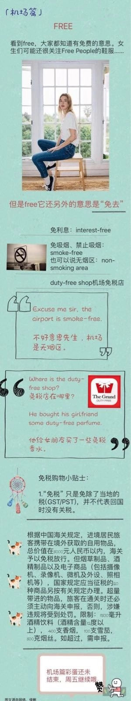

## 1st Day

### 1.1 背景介绍
 
 🦄️ 1. Glogg
 
 🐴这是一种瑞典热饮，混合了葡萄酒或者白兰地，糖，和香料，是平时放到火炉上，用于招待意外访客的最佳选择。
 
 🦄️Glogg的做法  ：
 
 🐴可以用杜松子酒，或者是伏特加之类的会更好一些。混合“丁香+豆蔻+八角+陈皮”，泡12小时以上；
 
 🐴第二天一早起来，将泡好的酒+红酒+柠檬汁+好多好多的糖，一定要记得是好多好多的糖哦~然后放到一起煮；
 
 🐴再加杏仁碎，煮开之后加提子干，蔓越莓，葡萄干和橙子块泡一下趁热喝，简直不要太舒服。
 
 
 
### 1.2熟词生义

🦄️1.「question」在文中的意思是“怀疑”，作动词；常见意思是“问题”，作名词

🐴原句：Do not question the princess.

🐴eg：He questioned my identity. 他怀疑我的身份。

🦄️2.「party」：在文中的意思是“organization”组织，队伍，作名词。它的常见意思是“聚会”，作名词。

🐴原句：The Duke ordered his two huge guards to join the search party as well.

🐴e.g. There is a party tonight.今晚有个聚会。

🦄️3.「duck」在文中的意思是“闪避，躲避”,作动词；常见意思是“鸭子”，作名词

🐴原文：They ducked around Marshmallow’s legs

🐴eg：He didn't duck fast enough to avoid the rock. 他躲避不及，被石块打中。

### 1.3句子解析

🦄️1.The fjord was still frozen, and all the officials who had arrived for the celebration of Elsa becoming queen were forced to stay since their ships were stuck.

🐴「fjord」峡湾，这里指的是当初被Elsa冻住的那个海峡。「who…..queen」这个长长的定语从句都是在修饰officials，「Elsa becoming queen」看似是一个句子，但我们仔细观察会发现，becoming是一个-ing形式，所以这个小句顶多算是一个短语。整个定语从句的大意是：来参加Elsa成为女王的仪式的官员们。

🐴「be forced to」被迫做某事。这里指的是他们被迫留下来。

🐴「since」表示原因，意思是“因为”，「stuck」是stick的过去式和过去分词，除了作动词表示“刺，戳”的意思之外，还能够作形容词，意思是“不能动的，被卡住的”，因为他们的船被冰冻住了，所以他们被迫留了下来。

🐴整句话的大意就是：整个峡湾依旧冰冻着，来出席Elsa加冕仪式的官员们因为船只都被冻住了，所以被迫留了下来。

🦄️2.“Are we just expected to sit here and freeze while you give away all of Arendelle’s trade goods?”

🐴「be expected to do sth.」被期望做某事。这里的意思是：难道我们只是被期望着坐在这里冰冻吗？（这句话读起来是不是不太通顺呢？同学们要学习这种英文思维的表达方式哟~当然在理解的时候，我们可以这样说：难道我们应该坐在这里冷死吗？）

🐴「give away」分发，这里指的是分发Arendelle王国的货物。

🐴所以整句话的大意就是：“当你把Arendelle王国的货物都分完的时候，难道我们应该坐在这里冷死吗？”

🦄️3.“Have you considered that your princess may be having a secret agreement with an evil magician to put an end to us all?”

🐴「have an agreement with sb.」与某人有协议。这里是在猜测女王和恶毒的魔法师有一个秘密协议。

🐴「put an end to」结束/终止/废除……举个例子：They should put an end to all wars.他们应该给所有的战争画上一个句号。

🐴整个句子的大意就是：“你想过没有？你的公主也许和恶魔有一个秘密协议要我们的命！”

🦄️4.“She left me in charge, and I will not doubt to protect Arendelle from people who will try to harm it.”

🐴「in charge」掌管，记得《老友记》里面有一句话：“I`m moving out, so you`re in charge of paying the rent.”我搬出去了，所以付房租的事情就归你管了。

🐴「no doubt to do sth.」毫无疑问地去做某事。

🐴「protect sth. from sth.」保护……不受……侵害。这里指的就是“保护Arendelle王国不受人们的侵害”，什么样的人们呢？后面跟着的定语从句指出来who will try to harm it，那些想要加害于它的人们。

🐴「try to do sth.」尽力做某事。「harm」在这里作动词，意思是“损害”；它还可以作名词，例如在「do harm to sth.」对……有害，这个短语中就是名词。

🐴所以整句话的大意就是：她留我掌权，我将毫无疑问地保护Arendelle王国不受那些想要加害于它的人的侵害。

🦄️5.“Should you find the queen,” the Duke told his men quietly, “be prepared to put an end to this winter.

🐴同学们是不是觉得「Should you find the queen」这句话怪怪的呢？其实它是一个「省略了if的虚拟语气倒装句」，我们把它写成“正常”的句子就是：If you should find the queen。在这里the Duke用了虚拟语气，也就是一种“几乎不可能”的语气，为什么呢？

🐴通过我们之前的阅读可以发现，他想掏空Arendelle王国的钱财，所以他希望的是女王Elsa出事，这样国家一乱套，他就可以从中作祟了。所以这句话可以这样说“万一你们找到了女王”。

🐴「be prepared to do sth.」准备做某事。这里指的是准备好结束这个冬天。

🐴所以整个句子的大意就是：万一你们找到了女王，你们就要准备好结束这个冬天。

🦄️6.Hans and his group made their way through the snowy woods and braved the dangerous canyons of the North Mountain.

🐴「make way」开路，腾出地方。这里说的是Hans一行人在白雪皑皑的森林中开路前行。

🐴「brave」在这里作动词，意思是“勇敢面对”，这里指的是勇敢面对危险的峡谷。

🐴所以整句话讲的就是：Hans和他的队伍在白雪皑皑的森林中开路前行，勇敢面对危险的北峰峡谷。

🦄️7.They ducked around Marshmallow’s legs, raced into the palace, and went up the staircase.

🐴「duck」在这里不是“鸭子”的意思咯~而是作动词，意思是“躲避”，这里指的是他们躲开大雪怪Marshmallow的腿。（毕竟雪怪体积大，整个就很笨拙嘛，哈哈哈）

🐴「race」全速前进，冲。这里指的是士兵们冲进宫殿。

🐴整个句子大意就是：他们躲开大雪怪Marshmallow的腿，冲进宫殿，走上台阶。

🦄️8.Trying to keep them away, she moved her arms, and the wall of ice forced one of the attackers onto the balcony.

🐴「trying to keep them away」是伴随着「move」这个动作发生的，意思是她挥动手，想要赶走他们。

🐴「force」逼迫，这里讲的是Elsa的冰墙将一个攻击者逼到阳台上。

🐴整个句子的大意为：她挥动手，想要赶走他们，随即一堵冰墙将一个攻击者逼到阳台上。

🦄️9.With another movement, Elsa created a series of icy spikes, so the man was forced to stay against the wall.

🐴「a series of」一系列的，一连串的，这里指的是一连串的“冰钉”。

🐴「be forced to」又出现了哦~意思是“被迫做某事”；

🐴「against」在这里意思是：倚靠。所以后半句讲的是这个人被迫靠着墙。

🐴整句话大意为：Elsa又一挥手，创造了一连串的冰钉，那个人就被逼靠墙了。

### 1.4本章短语

🦄️be forced to 被迫做某事
hand out 分发
be expected to 被期望做某事
give away 分发
put an end to 结束某事
🦄️in charge 掌管
protect …… from 保护……不受……侵害
in trouble 有困难
a group of 一组…….
watch out 小心

### 1.5 下节短语

🦄️continue to 继续做某事
be concerned about 关心……
be filled with 充满……
point out 指出
lose one`s mind 发疯，丧失理
🦄️start to do 开始做某事
right now 现在，立刻
one after another 一个接一个
change into 变成

### 1.6 每章一句

Anticipating the worest dosen't provide insurance from the worst happening。
做最坏的打算并不能确保最坏的情况不会发生。

### 1.7 章节彩蛋

