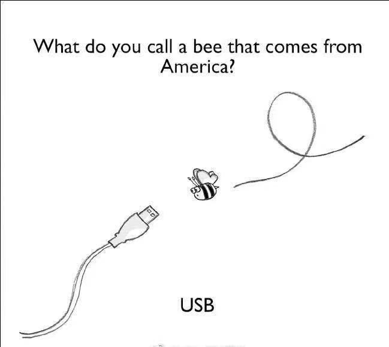
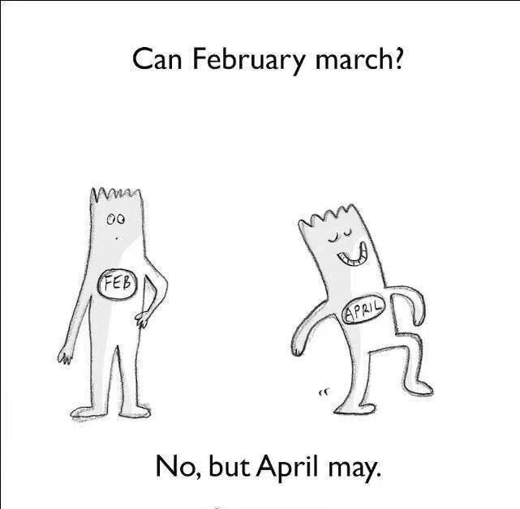
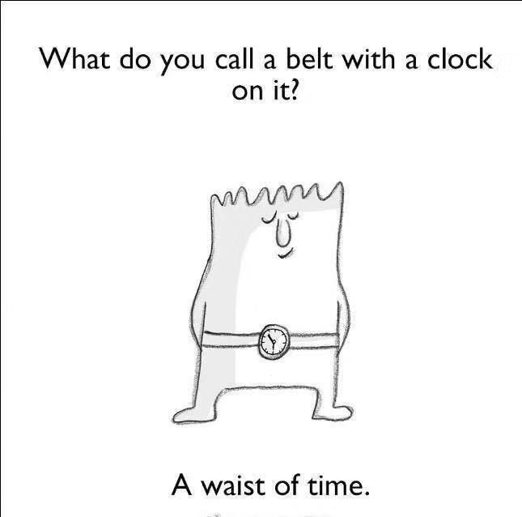
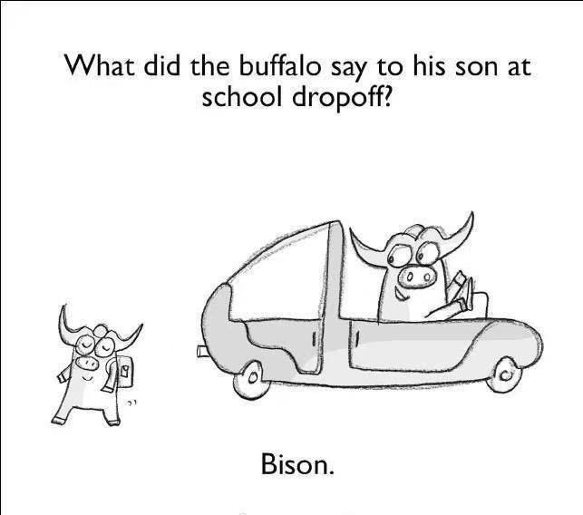

## 1st Day

### 1.1 背景介绍
 
 1⃣️ 手套堪比变身神器
 
 跟迪士尼动画电影中色彩都有其代表意义一样，出现在电影中的道具也有其作用，在《冰雪奇缘》中频繁出现的手套有着变身神器般的功用。从冰雪奇缘的全家福画像中可以看出，艾莎从小时候就开始佩戴手套，为了掩藏她的秘密她一直戴了13年，而当她放弃一切解脱之时，最先脱掉的就是手套，然后化身冰雪女王。艾莎作为迪士尼的第十三位公主，总与西方认为的不详数字13联系在一起，让手套也带上了微妙的不详感。
 
 
 
### 1.2熟词生义

1⃣️「sign」：手势。文中是Anna给了守卫一个手势示意他关门。sign 的常见意思是：签名。

❄️原句：She walked off and gave a sign to one of the guards.
❄️eg. Please give a sign to begin. 开始的时候请给一个手势。

2⃣️「order」在文中作动词，意思是“命令”，常见意思是“顺序”，作名词。

❄️原句： “Enough, Anna!” Elsa ordered.
❄️eg. He ordered that soldier to bring a book. 他命令那个士兵带一本书。

3⃣️「cry」在文中的意思是“叫喊，呼叫”，常见意思是“哭泣”

❄️原句： “There she is!” cried a woman.
❄️eg. “Monster!” he cried. “怪物啊！”他大叫道。

### 1.3句子解析

1⃣️ She saw /on Anna’s face/ that she was hurt.

💎这句话里面两个she 傻傻分不清楚，咱们来捋一捋~通过断句，我们发现，on Anna’s face是迷惑人的地方，事实上主句是：She saw that she was hurt. 她看见“她”受伤了。结合上下文我们会知道是Elsa看见Anna受伤。这里要注意

💎「hurt」有“心灵受伤”的意思，也就是Elsa说的话让Anna心灵受伤了。
于是这句话意思就是：她从Anna的神情上看见Anna心里很难受。

2⃣️“I said enough!” Elsa shouted, turning around. As she did, ice shot from the hand without glove, coating the floor of the room and freezing into big icy plumes.

💎「shot」是shoot 的过去式和过去分词，意思是“射出”。shoot 在这里用得非常传神，因为Elsa此刻已经非常愤怒，失去理智，冰雪魔力已经变成她的防御武器，像子弹一样从手中射出（shot）。

💎「coat」在这里作动词，意思是“覆盖”。这里是说从她手中射出的冰覆盖了房间的地板。

💎整句话讲的就是：“够了！”Elsa吼道，就在她转身的时候，冰从她没有戴手套的那只手中射出，覆盖了房间的地板，冻成了巨大的冰柱。

3⃣️ She was so afraid now that her secret was out.

💎「now that」既然，由于，因为。例如：Everything looks different now that I see you. 因为见到了你，一切都截然不同了。

💎「out」有泄露的意思，这里就是她的秘密泄露了。
整句话大意就是：她害怕极了，因为她的秘密已经泄露了。

💎「try to do sth.」尽力做某事，相当于「spare no effort to do sth.」。例如：We should spare no effort to find the soldier. 我们应该不遗余力找到这名士兵。文中 try hard not to do意思是“尽全力不要做……”。

💎整句话的意思就是：Elsa避开这个女人，很快从人群中挤出去。在她退后的过程中，尽全力不要碰到任何一个人。

4⃣️ Elsa backed away from the woman and quickly moved through the people, trying hard not to touch anyone as she backed away.

💎「back away」退后

💎「move through」穿过，与push through意思相近。前半句说的是：Elsa避开这个女人，很快从人群中挤出去。

5⃣️ As soon as she touched the fountain, the water in it froze to hard ice.

💎「as soon as」作连词，表示“一……就….”，这句话意思是：她一碰到喷泉，里面的水就变成了坚冰。

6⃣️Cold air travelled through Arendelle as Elsa ran along the streets, leaving ice and snow behind her everywhere she went.

💎「travel through」穿过，「as」表示一种伴随的状态，前半句是说，随着Elsa沿着街道跑过，冷空气也穿过整个Arendelle王国。

💎后半句也是伴随着前半句发生的，leaving ice and snow behind her意思是：她将冰雪留在身后。

💎整句话意思就是：随着Elsa沿着街道跑过，冷空气肆虐整个Arendelle王国。所到之处，冰雪无所不及。

7⃣️ Elsa looked over her shoulder as she came near the water.

💎还记得我们之前讲过的「look over one`s shoulder」吗？这个短语的意思是：转过头去。

💎「as」在这里的意思是：当……，也就是“当她走到水边时……”

💎这句话讲的就是：当Elsa来到水边时，她回头看了看。从这里我们能够看出，Elsa在遇到前方宽阔的海峡时，还是有些许犹豫到底要不要走进去。

### 1.4本章短语

run after 追逐
come off 脱离
stay in control 控制
push through 推开
now that 既然，因为，由于
back away 退后
try to do sth./ spare no effort to do sth. 尽力做某事
as soon as 一……就……
run away from 逃避…….
stay away from 远离……
turn into 变成……
too… to… 太……以至于
catch up 赶上

### 1.5 下节短语

### 1.6 每章一句

the finest of pleasures are always the unexpected ones。
最好的快乐永远是那些意料之外的。

### 1.7 章节彩蛋

今儿给大伙分享一些英语中的冷段子，大家品品看～
看懂英文段子需要一定的英文功底以及语境能力，还需要同学们丰富的脑洞哦

1⃣️.美国也叫the united state，简称us

2⃣️.这是一个月份名的笑话，March既有三月的意思，还有前进的意思。may是五月也有可以的意思，所以April may既可以表示四五月，也可以表示April是可以March的～

3⃣️.waist（腰）与waste（浪费）谐音

4⃣️.buffalo应该和他的孩子说 bye son，
缩写bison，意思是野牛

