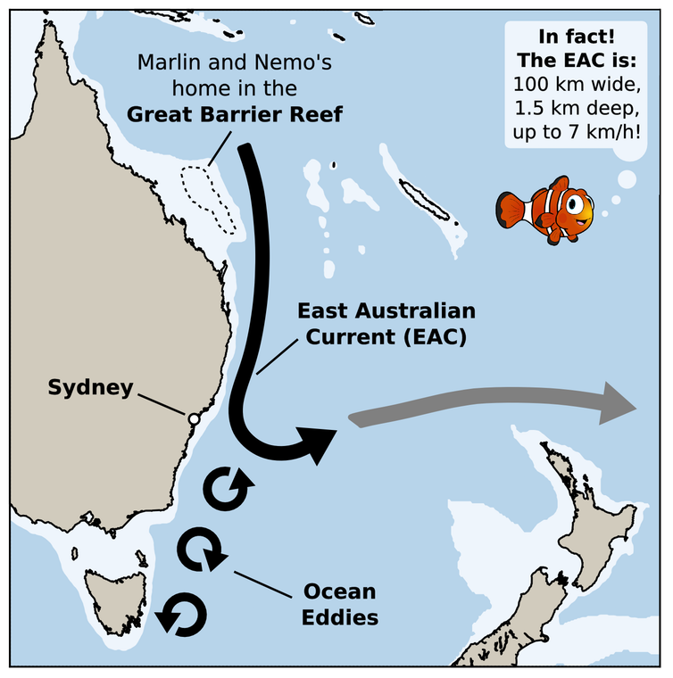

## 1st Day

### 1.1 背景介绍
 
 1⃣️ moonfish
 银鳞鲳，学名为Monodactylidae，身体像CD碟片一样扁平，为银白色，一般体长25cm左右。这种鱼主要生活在非洲、印度、南亚以及澳大利亚沿岸。
 
 2⃣️ swordfish
 剑鱼，嘴巴就像一把剑一样突出且长，体型庞大，且游速极快，性情凶猛，经常攻击大型水生生物。
 
 3⃣️ lobster
 
 就是我们平时吃的大龙虾，其学名应该是海鳌虾。lobster是一种著名的美食，比如美国波士顿就以lobster闻名。大部分厨师会将活的海螯虾放进滚水中直接煮熟或蒸熟，小部分会先用水产品电击机电死龙虾减少其痛苦。2017年在澳洲悉尼，一间海鲜市场餐厅没有让龙虾先失去知觉再宰杀，被悉尼Downing Centre法庭指控虐待动物，宣布判处餐厅罚款1500澳元。
 
 4⃣️ East Australian Current
 
 东澳洋流，简称为EAC，是一股沿着澳洲东岸北边流向南边的洋流，是澳洲沿岸最大的洋流。东澳洋流会在新南威尔士附近形成漩涡，从而将海洋生物带到澳洲东南岸的亚热带海域。所以故事里说生活在大堡礁的Marlin要顺着EAC去悉尼找Nemo，是完全可能的，只是在电影里的洋流比较窄，但实际上EAC是非常宽阔弘大的一股洋流。下图完美地说明了故事中的洋流路线：
 
 
 
 另外这篇文章——Can you surf the East Australian Current, Finding Nemo-style?（ http://theconversation.com/can-you-surf-the-east-australian-current-finding-nemo-style-27392）也清楚地解释了EAC的原理和作用，有兴趣扩展阅读的同学可以去看看。
 
### 1.2熟词生义

1⃣️「hold」在文中的意思是“停止”。

🌟原句：“Hey! Hold it!” Marlin shouted. “Wait a minute! I’m trying to talk to you.”
🌟例句：Hold your fire! （不要开枪！）

2⃣️「drive」在文中表示“驱使，使某人……”。

🌟原句：It was driving Marlin crazy.
🌟例句：Hunger（饥饿） drove her to steal（偷窃）.

3⃣️「right」在文中为副词，表强调，意思是“就是，正是”。

🌟原句：They all waited there, looking right at Marlin.
🌟例句：The bus came right on time.

4⃣️「impression」在文中意思是“模仿秀”，指的是通过模仿别人来逗乐的一种举动。
🌟原句：You like impressions?
🌟例句：He did an impression of Tom Hanks.

5⃣️「put」在文中表示“表达，说话”，put in指“插嘴，补充”。

🌟原句：“It’s a swordfish!” Marlin put in.
🌟例句：Could I put in a word?

6⃣️「current」在文中作名词，表示“水流、洋流”。

🌟原句：Big current—can’t miss it.
🌟例句：He swam to the shore（海滨） against a strong current.

7⃣️「head」在文中作动词，表示“前进，朝前走”。

🌟原句：Head straight that way.
🌟例句：Where are we heading?

### 1.3句子解析

1⃣️ She’d been repeating the address ever since she’d remembered it. “42 Wallaby Way.” It was driving Marlin crazy. “Okay. All right, here’s the thing,” he told her. “I think it’s best if I just carry on from here . . . by myself.”Dory thought for a moment, not understanding.

✨「’d been repeating」，’d在这里是had的省略式，had/have been doing表示“从……以来持续做某事”，强调动作在这段时间的延续；

✨「 ever since」表示“自从”，所以这里是说Dory自从想起头罩上的地址开始，就一直在重复那个地址—— “42 Wallaby Way”；

✨「driving Marlin crazy」，drive在这里作使动，这里是说Dory快把Marlin逼疯了；

✨「here’s the thing」，这句话用在有话要说、需要引起别人注意的时候，相当于“听我说”或者“是这样的”；

✨「 it’s best if…」表示“最好是……”；「carry on」表示“继续进行某件事”。

✨全句大意：自从Dory想起来头罩上的地址，她就一直重复着那个地址—— Wallaby路42号。这简直要把Marlin逼疯了。Marlin跟Dory说：“好了好了，听我说，我觉得最好从这里开始，我就……自己一个人继续去找我儿子。”Dory想了想，不太明白Marlin的话。

2⃣️ “You want me to leave?” Dory asked in disbelief. “Well, I mean not . . . Yes. It’s just, you know . . . I can’t afford any more delays, and you’re one of those fish that cause delays.”

✨「in disbelief」意思是“不相信地”；「 can’t afford」，指“承受不起”、“负担不了”；

✨「delay」在这里作的名词，意思是“延误、拖延”。

✨全句大意：Dory不相信地问：“你要我走？” Marlin说：“额，我也不是说……是的，就是，你知道……我没办法再耽误下去了，但是你又是那种老是让我误事儿的鱼。”

3⃣️ “You like impressions? Okay,” the fish said to the others. “Just like we practiced, gentlemen . . .”The moonfish swam into different positions, forming the shape of a swordfish.

✨「impressions」在这里指的是一种通过模仿别人来逗乐或者取悦他人的活动，可以理解为“模仿秀”；

✨「 swam into different positions」，指银鳞鲳鱼们说着便游到了不同的位置；

✨「 forming the shape of」，指“形成了……的形状”。

✨全句大意：银鳞鲳鱼们想让Dory开心起来，带头的那个问Dory喜不喜欢看模仿秀，然后告诉其它鱼：“好了先生们，就像我们之前练习的一样……”，接着银鳞鲳鱼就开始朝各个不同的位置游，形成了一条剑鱼的形状。

4⃣️ The moonfish did more impressions. They changed into a lobster, an octopus, a ship . . . But Dory didn’t get a single one right.

✨「didn’t get a single one right」，get sth. right，指“搞清楚某事”或者“猜对某事”，「 a single one」中single表示强调，所以这里是说Dory一个都没猜出来。

✨全句大意：银鳞鲳鱼们做了好几个模仿秀，他们变成大龙虾、大章鱼、船……但是Dory连一个都没猜出来。

5⃣️ “What’s the matter? While they’re doing their silly little impressions, I am miles from home, with a fish that can’t even remember her own name. Meanwhile, my son is out there. . . . But it doesn’t matter, ’cause no fish in this entire ocean is gonna help me.”

✨「 While」表示“当……的时候，在……期间”；「miles from home」指“离家很远，背井离乡”；「Meanwhile」意思是“与此同时”；

✨「it doesn’t matter」，表示“都没关系、都不重要”，注意这里的matter是动词，与「What’s the matter?」中的matter是不同的意思，后者是名词，指“问题”。

✨全句大意：Marlin又开始吼Dory了，说“怎么了？当他们在做这些傻不拉几的模仿秀时，我正背井离乡地和一个连自己名字都不记得的鱼在一起。与此同时，我儿子还不知道在哪儿……但是这都不重要，因为整个海洋里，没有一只鱼愿意帮我。”

6⃣️ “You wouldn’t know how to get there, would you?” asked Dory.“What you wanna do is follow the EAC. That’s, uh, East Australian Current,” the fish explained.

✨「You wouldn’t know how to get there, would you?」这是一句非常礼貌地问路的方式，非常委婉，字面意思为“你应该不知道怎么去，对吧？”，其实就是在询问别人“应该怎么去”；

✨「What you wanna do is」，wanna本身是want to的缩略语，在这里这句话相当于「What you need to do is」，“你需要……”；「follow the EAC」，指“跟着东澳洋流走”。

✨全句大意：Dory问银鳞鲳鱼：“请问应该怎么去悉尼啊？”，带头那只鱼说“你需要跟着EAC走，也就是东澳大利亚洋流”。

7⃣️ “When you come to this trench . . .” The fish formed a picture of two large, steep rock walls with a thin opening in between them. “Swim through it. Not over it!”

✨「 trench」指“沟渠”；「 a thin opening」，这里thin指的是“窄的”，opening指“开口”，所以这里是两堵又大又陡的石墙中间有一个窄的开口；

✨「 through」表示“从里面穿过去”，而「 over」表示“从上面越过去”。

✨全句大意：“当你们走到这个沟的时候……”，说着这些鱼组成了两堵又大又陡的石墙，中间有一个窄的开口，“要从中间穿过去，不要从上面越过去”。

8⃣️ Then she turned to catch up with Marlin, who was already on his way.

✨「catch up with」意思是“追上，赶上”。 e.g. Come on，let’s catch up with her as fast as we can!(来吧，咱们尽快追上他！)

✨「was…on his way」文中是“上路、出发”的意思。e.g. I was already on my way while they were just dreaming.（当他们还在空想的时候，我已经开始行动了。）

✨这个句子的意思是：然后她转身去追赶已经上路了的Marlin。

### 1.4本章短语

sk for directions 问路
this way and that 四面八方，朝各个方向
drive sb. crazy 让某人疯掉
carry on 继续
hurt one’s feelings 伤害某人的感情
in disbelief 不相信地
in front of 在……前面
cheer （sb.） up （让某人）高兴起来
take a guess 猜一猜
put in 插嘴，补充
change into 变成
help along 帮忙，促进
Don’t mention it. 没关系，别客气
on one’s way 在路上

### 1.5 下节短语

all at once 突然
at the edge of 在……的边缘
in no time 很快
reached for 伸手去拿
get away 走开
get set 预备开始
keep up 追赶上
break the rules 犯规
on one’s mind 在脑子里
stay awake 保持清醒
be used to 习惯于
block one’s way 挡住某人的去路
as far as sb. could see 目之所及
get hurt 受伤
cry out 大声呼喊

### 1.6 每章一句

### 1.7 章节彩蛋

