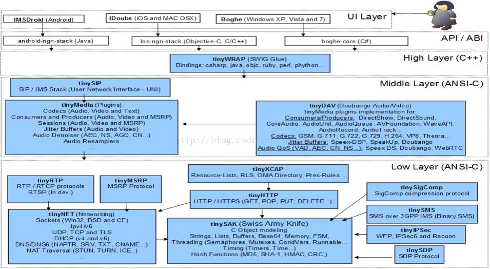

# doubango SIP

## 一、doubango简介

###  1.1 doubango官网

[doubango官网地址http://www.doubango.org/](http://www.doubango.org/)
doubango常用项目国内镜像（放在淘宝的svn服务器），目前有4个项目：doubango, idoubs, imsdroid, telepresence。项目的svn地址如下格式
http://code.taobao.org/svn/【项目名称】/trunk
例如idoubs，可直接http://code.taobao.org/svn/idoubs/trunk，版本以最新2.0为准，去掉了1.0的代码和库，以前的svn log没了

###  1.2 简述
doubango是一个开源的VOIP基础平台， 并能用于嵌入式和桌面系统的开源框架，该框架使用ANSCI-C编写，具有很好的可移植性。

### 1.3 doubango的特点
根据doubango的框架、特点与linphone的对比，显然doubango更适合做视频会议系统和视频会议终端的选择，理由？根据linphone的rtp会话管理可见只适合2方进行视频通话，如要支持多方（>3）视频会议，需MCU配合server进行音视频转发和mix，linphone对于nat穿透的方案只有stun和转发，linphone适合更适合当做一款网络电话终端供普通网民当做视频电话用。

###  1.4 包含的组件
doubango包含了 SIP/IMS (VoIP) 的客户端、服务器端的组件。

|ret|√|int|结果（0-成功；其他-失败）|
|msg|√|String|相关描述，失败后的提示|
|running_activity|√|object|本地活动参数集合|

|1|Client-side components|
|:----- |----- |
|sipML5|HTML5 SIP client using webrtc2sip Gateway. Enjoy our live demo »|
|clik2dial|A complete Click-to-Call Solution using webrtc2sip Gateway and sipML5.Enjoy our live demo »|
|webrtc4all|WebRTC extension for Safari, Opera, Firefox and IE.|
|Boghe|SIP video client for Windows Phone 8 and Surface Pro.IMS/RCS Client for Windows XP, Vista, 7 and 8|
|iDoubs|SIP/IMS VideoPhone for iOS (iPhone, iPad and iPod Touch) and MAC OS X.|
|IMSDroid|SIP/IMS Client for Android.|
|libSigComp|Signaling Compression (SigComp) library|

|2|Server-side components|
|:----- |----- |
|webrtc2sip|Smart SIP and Media Gateway to connect WebRTC endpoints to any SIP-legacy network.Enjoy our live demo »|
|telepresence|Open Source TelePresence system with a smart and powerful MCU. Enjoy our live demo »|
|Flash2IMS|Adobe® Flash® to SIP/IMS Gateway.|
 

 

###  1.5 doubango的主要特点

* Powerful MCU (Multipoint Control Unit) for audio and video mixing
* Stereoscopic (spatial) 3D and stereophonic audio
* Full (1080p) and Ultra (2160p) HD video up to 120fps
* Conference recording to a file (containers: *.mp4, *.avi, *.mkv or *.webm)
* Smart adaptive audio and video bandwidth management
* Congestion control mechanism
* SIP registrar
* 4 SIP transports (WebSocket, TCP, TLS and UDP)
* SA (direct connection to SIP clients) and AS (behind a server, such as Asterisk, reSIProcate,
openSIPS, Kamailio…) modes
* Support for any WebRTC-capable browser (WebRTC demo client at http://conf-call.org/)
* Mixing different audio and video codecs on a single bridge (h264, vp8, h263, mp4v-es,
theora, opus, g711, speex, g722, gsm, g729, amr, ilbc)
* Protecting a bridge with PIN code

* Unlimited number of bridges and participants

* Connecting any SIP endpoint
* Easy interconnection with PSTN
* NAT traversal (Symmetric RTP, RTCP-MUX, ICE, STUN and TURN)
* RTCP Feedbacks (NACK, PLI, FIR, TMMBN, REMB…) for better video experience
* Secure signalling (WSS, TLS) and media (SDES-SRTP and DTLS-SRTP)
* Continuous presence
* Smart algorithm to detect speakers and listeners
* Different video patterns/layouts
* Multiple operating systems (Linux, OS X, Windows…)
* 100% open source and free (no locked features)
* Full documentation
* …and many others

### 1.6 doubango架构图

说明：

tinySAK (Swiss Army Knife): Utilities functions (SHA-1, MD5, HMAC, String, List, Timers, Thread, Mutex, Semaphore, ...)
tinyNET: Networking (DNS, DHCPv4/v6, STUN, TURN, ICE, ENUM, Sockets, ...)
tinyHTTP: HTTP stack (CONNECT, DELETE, GET, HEAD, OPTIONS, PATCH, POST, PUT, TRACE, ...)
tinyXCAP: XCAP stack (AUID manager, URL generator) without XML parser (See Java code for parsers)
tinyIPSec: IPSec SA manager. Useless for Android but you MUST have it
tinySMS: SMS over IP (SM-TL, SM-RL) for IMS/LTE networks
tinySIGCOMP: Signaling Compression
tinySDP: SDP protocol
tinyRTP: RTP/RTCP protocols
tinyMSRP: MSRP protocol (Chat and File Transfer)
tinyMEDIA: Media plugins manager (Audio, video, Codecs, sessions, MSRP, QoS, ...)
tinyDAV(Doubango Audio Video): Media plugins implementation
tinySIP: SIP/IMS stack

## 二、协议栈结构

### 2.1 软件设计方法

软件设计的两种方法有自顶向下与自底向上两种。

对于自顶向下而言，先设计好用户接口，再往下延伸至各个功能块的具体实现。而对于自底向上而言，自然是有了设计好的各个功能代码块，再将这些功能代码块拼接成具体的用户接口，然而实际的软件实践中，这两种方法是同时展开的，因为无论单独实施哪一种，都是有所缺陷，会令人陷入某种困境。

设计软件如此，那么在分析一款软件的时候，结合自顶向下与自底向上的方法，必然是更好的一种捷径，对软件的分析能更通透和彻底。

 
自顶向下-Doubango协议栈的设计方式

         Doubango是一个sip协议客户端软件，通过学习它，能更好地掌握sip协议栈，不仅如此，在学习Doubango的过程中，对于其他软件的设计问题，例如怎样设计才能使各个软件模块达到高聚类低耦合的设计原则，各个模块间的接口如何才能很好的衔接，都在Doubango的设计中有一定的体现。对于一个设计很好的软件系统，功能模块的作用必然是明晰的，聚类的，与其他模块间的功能是能达到最低限度依赖的。

 

SipStack类

在Doubango的最顶层，对于协议栈的抽象描述便是这个SipStack类。它有两方面的作用：

1)        提供对于协议栈的抽象。

2)        底层代码与高层代码的粘合层。

SipStack 类定义在SipStack.cxx中，其接口描述定义在SipStack.h中。

 

分析一个类，最好的方法是：首先读其私有字段，这代表了它的内部机理；其次读其接口，这代表了它的对外功能，也就是用户可以用它来做什么。

 

SipStack的私有字段有四个：

a)        SipCallback*callback;

这个字段由上层代码提供，也就是由用户提供，在创建一个SipStack协议时，用户必须提供一个SipCallBack类的实例，传入SipStack的构造函数：

SipStack(SipCallback*callback,

const char* realm_uri, const char* impi_uri, const char* impu_uri);

b)        DDebugCallback*debugCallback;

这个字段功调试所用。

c)        tsip_stack_handle_t*handle;

这个字段代表了底层对于协议栈真正的描述。在SipStack类被构造时，会根据传入的参数真正地创建一个在底层运行着的协议栈。

d)        static unsignedcount;

代表了该协议栈的实用计数。

 

由这四个字段不难看出，SipStack类是作为一个粘合层而存在的，它是高层和底层的粘合剂，高层通过SipCallBack注册到SipStack类，而SipStack类又通过tsip_stack_handle_t实例关联底层，当SipStack在其构造函数中创建tsip_stack_handle_t实例时，会将本粘合层的回调函数intstack_callback(consttsip_event_t*sipevent)注册在tsip_stack_handle_t的对应字段中，这样，当底层的sipevent到来时，会通过回调机制层层传递到应用程序的最顶层。
