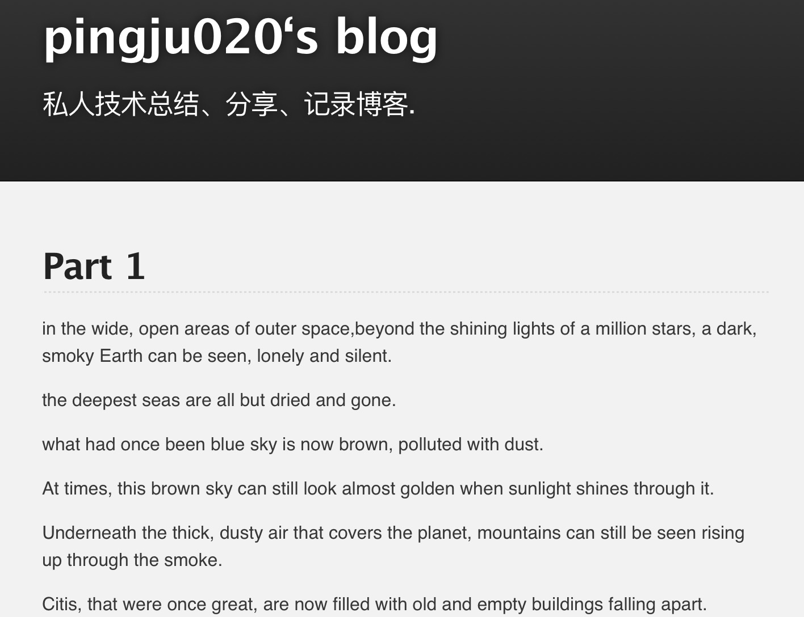
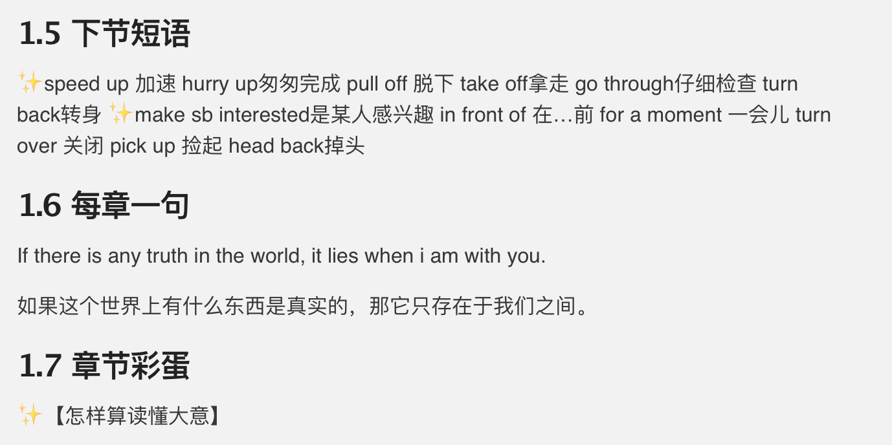

## 薄荷阅读99天阅读感想

>我们总是把自己不懂某个知识的原因归咎于我们当初接受教育期间没人教给我们，而忘记我们完全可以自己去学习；我们往往在思考要不要做一件事的时候，首先考虑这件事能给我们带来什么实际收益。

### 1.100天到底算不算一个很长的时间段？

100多天前从朋友圈看到有个朋友在打卡薄荷阅读的时候，我首先想到的是这个问题。那时候我并没打算报，所以默默跟自己说：100天太长了，她肯定坚持不下来。是的，都是又要上班又要带小孩的人，而且工作这一项就要忙到飞起，每天从哪里找时间去读那玩意？再说读了能干嘛？

那时候觉得100天是真的很长的时间啊，快要占到一年的三分之一了。

不过还是顺手做了个词汇量测试。

结果有点吓到自己，2000多词汇。

好巧，那天回家小闺女蹦蹦跳跳跑过来问我：“妈妈，紫色用英语怎么说？”。她刚上中班，从这学期开始，幼儿园每周给上两节英语课。

尴尬的是，我真的不知道。

我搜罗了大脑中每个记忆点，只翻腾出，我曾经学习过红色、绿色、蓝色、白色、黑色、棕色、黄色，独独没有紫色。还好有百度，让我在大学毕业10年后，终于弄明白了原来紫色用英语表达是：**purple**

当时还心说，我们那个时候学习跟现在真的不一样，你看我学生时代，英语也没有很差，但是居然连紫色怎么表达都不知道。而我们的小孩，她在幼儿园就已经学习这些了。

后来更扎心的事实是，我翻到了她们的英语教材，颜色那一课的教材里根本没提及紫色。也就是说小朋友不是因为在幼儿园学了没记住回来问我的，而是她压根就没学到，她自己想要知道。

**我们总是把自己不懂某个知识的原因归咎于我们当初接受教育期间没人教给我们，而忘记我们完全可以自己去学习；我们往往在思考要不要做一件事的时候，首先考虑这件事能给我们带来什么实际收益。**

所以我也该进行一次主动的学习了。或者先报个阅读班，看看能不能坚持到100天？

### 2. 不如先尝试尝试？

 
我选择迪士尼的课程，100天4本书，都是我喜欢的故事，希望给我自己坚持的动力。

前面的时候读的是真的费力。

《机器人总动员》一开始首先上来的是一大段情景的描述，这对我这种希望通过好玩的故事带动自己阅读兴趣的人来说就是莫大的打击。而且这也的确太难懂了。

我记得很清楚，那天阅读群里，大家追着老师一句一句求翻译。

我没好意思这么干。

但是那天的文章我读了6遍。

终于感觉有点理解了，还听着语音，将那个章节敲到了自己博客上面。（如下图：）

比较欣慰的是，晚上阅读群里，老师放了全文的讲解，有词汇，有句子。这样我的困惑一下子就得到了解决。

看到还有小伙伴在追问这，追问那，我似乎找到了自信心。你看，我也有自己的方法去弄懂一篇长约800词的阅读理解不是吗？

那个时候起，我跟自己打气，一定要坚持读完100天，而且要每天都按时读！

当然，老师的讲义我也是不会放过的，同样一句句拷贝过来，贴到自己的博客里。

这样，我的阅读历程就算正式开始了，开头还不错。

### 2. 满勤计划泡汤

 
开始后，接下来的事情就简单了，无非按时阅读打卡，然后再坚持。不过有的行为坚持了下来，有的却没有。比如坚持下来的：每天整理老师前一天的讲义，贴到自己博客；再比如没坚持几天的：每天抽时间敲一遍当天阅读内容。

甚至在10月27号之前，我是很坚定自己能得满勤（100天全绿）。

但是。。。

那天晚上我打开阅读的时候，小朋友喊我帮她搭积木。等我搭完，给她洗漱完、讲完故事，我也跟着她进入了梦中。一觉醒来，已经夜里1点多，我与那天的小绿圈就这么失之交臂了。

不过这次后，我把阅读时间调到每天早晨。晚上睡前还确认下有没有忘记。

虽然错过了全勤，但是却成为了良好阅读习惯养成的由头。

时至今日，本期课程只剩下明天一节。

中间，经历过长途回老家一周；经历过三四次版本上线通宵加班；经历过手机掉水里报废，但是哪个也没能阻碍我按时阅读。

瞧，100天也没有想象中那么长啊。

### 4. 读了能干嘛

 
你看，现在让我回想，还觉得纠结要不要报这期阅读仿佛就在几天前。

100天真的没有想象那么长！而且坚持一个习惯100天，也没有想象中那么难啊。

而且，现在我也能清清楚楚阐述报名之前的疑惑：读了能干嘛？

首先，我的词汇量不知不觉中就增加了，上次测试已经3000多了，所以果断续报了经典迪士尼系列。

其次，没事的时候我居然也能给小朋友普及普及简单的英语知识了。特别是我家小朋友这种思维特别发散的，这对于我来说已经是质的突破了。

最后，阅读本身就足以带给我们极大的快乐。读到Wall.E一个人在地球上孤独地打扫时、Anna历经困难走进姐姐的冰雪宫殿时、Nemo第一次尝试放小石子失败时、Moana因为Maui的离开而不知该何去何从的时候，我们的纠结，我们替主人公的紧张，我们替他们落寞那可都是实实在在的体验啊。

当然能坚持至今，薄荷阅读本身的产品设计很考究也是一个最主要的因素。试想，如果一个章节阅读完需要的不是10来分钟，而是半个小时或1个小时，我恐怕也是很难坚持至今的。

### 5. 后续

这期马上结束了，但是我的阅读并不会结束。大家49期见！

